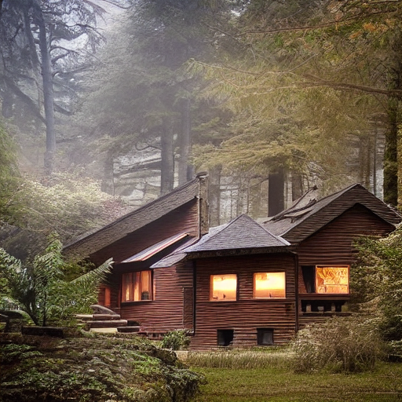
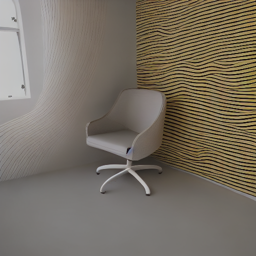

# Introduction

This github repository consists the code and results of the Avataar assignment. You can refer the [HB1.pdf](./HB1.pdf) for the assignment problem. The complete code for the assignment can be found in the SD_ControlNet.ipynb notebook. I will go through the code for each tasks in the sections below along with their results and other experiments I tried out.

## Task 1

The Task 1 needed to generate the "best" possible output images with the given prompt and depth images.

First I created some helper functions to load the depth images from the [Metadata/Images](./Metadata/Images/) folder. Next we load the different Control Net models for : depth, canny, normal (bae and midas) and HED. I tested with 2 different types of control net models for each condition mainly the Controlnet v1.1 and Controlnet v1.0.

The 5 controlnet conditions mentioned above are what I am going to experiment with mainly to get better images. The depth image has been provided to us, the others we will create from the depth images. After loading the control net models, I have created a dictionary to try out different combinations of them in the Stable Diffusion pipeline.

The *create_pipeline()* loads the Stable Diffusion v1.5 into the Stable Diffusion Control Net pipeline and sets up the scheduler. I have disabled pipeline's safety checker to always get an image output from the pipeline.

Now for converting the Depth images to HED, Normal BAE, Midas Normal and Canny, I use the [controlnet_aux](https://github.com/huggingface/controlnet_aux) library. It provides a easy way to use [lllyasviel's ControlNet Annotators](https://github.com/lllyasviel/ControlNet/tree/main/annotator).

After loading the checkpoints for each annotator I have created the final generate_image() function to create all the controlnet condition images from the depth image and then output a generated image based on the control net model selected.

### Observations and Results

I tried out the image generation with a variety of controlnet conditions and their combinations. These transformed images are stored in [Transforms](./Transforms). Each subfolder has all transformations of the depth image provided at [Metadata/Images](./Metadata/Images/). 

All the generated images with the help of these controlnet condition images are in the [Results/Task1](./Results/Task1/) directory.

The naming convention followed is :
controlnetCondition_0 : 0 stands for ControlNet v1.1
controlnetCondition_1 : 1 stands for ControlNet v1.0

Example : depth_hed_0 means the controlnet condition images used are Depth and HED with ControlNet v1.1.

#### Best Generated Images

| Depth Image                      | Generated Image                           | Control Net condition         |
| -------------------------------- | ----------------------------------------- | ----------------------------- |
|   |  | Controlnet v1.1 Depth  |
|   |  | Controlnet v1.1 Depth  |
|   |        | Controlnet v1.1 Depth         |
|   |  | Controlnet v1.1 Depth + Canny |
|   |    | Controlnet v1.1 Depth + Canny   |
|  |        | Controlnet v1.1 Depth         |
|  |        | Controlnet v1.0 Depth         |

The table above showcases the best images I was able to generate with the StableDiffusionControlNetPipeline. These can also be found [Results/Task1/Best](./Results/Task1/Best).
 Below I discuss the quality of generated images with different conditions in controlnet.

##### Depth Image
These gave consistently very good results for all the images. I think this might be because all the condition images are also derived from this itself. Hence they fail to add more useful information to the generation process.

##### Canny Edge
In images where there are objects with highly defined edges canny helps a lot as seen below. The generated image with depth is unable to generate the small objects properly whereas canny edges helps to generate those objects.

Original Depth Image | Generated Image with only Depth Condition        | Canny Edge Map |  Generated Image with only Depth + Canny Condition 
:-------------------------:|------------| ------------|:-------------------------:|
 |   |  |  |
 

But sometimes, since the canny edges are generated from the depth images they fail to detect edges due to the very dark regions in the depth image like in the case of the "room with a chair" image.

Original Depth Image | Canny Edge Image          
:-------------------------:|----------- |
 |   |
 

##### HED
In most of the HED images since it detects "soft edges" it causes the model to generate images with smudges as shown below.

Example 1 | Example 2        
:-------------------------:|----------- |
 |   |

##### Normal BAE
The images generated with the Normal BAE condition we can sometimes see a artifact (wavy lines) running through the image. This might be because the normal bae has been generated from the depth images instead of a regular image. You can see the below images for this.

Example 1 | Example 2        
:-------------------------:|----------- |
 |   |

##### Midas Normal Map
For all the generated images the Normal map from the Midas detector consistently gave poor results with many artifacts.

Example 1 | Example 2        
:-------------------------:|----------- |
 |   |

#### Conclusion
In most scenarios the best image generation is with using only Depth Image as the condition for the control net. In some cases adding the canny edge condition image is helpful where there are well defined edges.

#### Experimenting with Size

The table below shows the results for generating images of different sizes.

| Size        | Image                                  |
| ----------- | -------------------------------------- |
| 128 X 128   |    |
| 256 X 256   |    |
| 512 X 512   |    |
| 768 X 768   |    |
| 1024 X 1024 |  |

We can see that the generated image looks better with increasing size but as we can see for this example image it does not follow the depth images as we want it to and generates the mountains behind it. Also a larger image will require more number of inference steps to run to produce a perfect image which does not look artificial. The lower resolution images ike 128x128 does not look like the prompts or the depth images at all in any case. In case of 256x256 we can see that the image is starting to form according to the prompt and depth but it is not that good.

Hence I stick to 512x512 image generation which seems to give a good balance between quality and following the depth condition images correctly.

All the other different size generated images with each depth image can be found in [Experiments/Size](./Experiments/Size).

### Experimenting with Custom Normal Maps and Canny Edges

Before using the Annotators I was creating the normal maps and canny edges myself. I checked out the performance with different parameters of the canny edge to check for any improvements. The custom created Normal maps and the generated images from them can be found [here](./Experiments/Normal_Maps). For the custom Canny edges and the generated images from them you can head [here](./Experiments/Canny_Edges).

From these experiments I found that if we have a stricter canny edge detector which detects a lot of edges the model tries to condition the final generated image with all these edges and hence the final generated images is not proper and these edges are very evidently visible. This can also be since we are trying to create the canny edge images from the depth images instead of the actual original image.

Example 1 | Example 2        
:-------------------------:|----------- |
 |   |

## Task 2

For the second task I have generated different aspect ratios from this [Depth Image](./Metadata/No%20Crop_/2_nocrop.png).

| Aspec Ratio | Size       | Image                                       |
| ----------- | ---------- | ------------------------------------------- |
| 5:3         | 960 X 576  |    |
| 3:2         | 960 X 640  |    |
| 5:4         | 960 X 768  |    |
| 1:1         | 960 X 960  |    |
| 16:9        | 1024 X 576 |  |
| 4:3         | 1024 X 768 |  |

To answer the questions for the task,
Yes we can generate images of different aspect ratios using SD. For these different apect ratios we can see that the performance of the model is similar. For all the aspect ratios the model is able to generate a good image as seen in the above table. Although some images do appear stretched or compressed since they are conditioned by the underlying depth image which has an aspect ratio of 5:3.

## Task 3

For this task I am working with the 7th image (House in the forest).
The generation latency for 20 number of inference steps is around 7 seconds. I try to reduce using the below methods.

### Reducing Number of Inference Steps
One obvious way of reducing the generation latency is by reducing the number of inference steps. I visualize the images for different number of steps to check and we see that the time reduces greatly (only around 4.5s for 10 steps) and the quality of the final generated image remains almost identical in the later steps. Hence we can run the generation only for 10 steps to have a generation latency of only 4.5 seconds!

| Number of Inference Steps       | Generation Latency in seconds    | Image |
| ----------- | -------------------------------------- | ---------------- |
| 1   | 2.7 |    |
| 2   | 2.5 |    |
| 3  | 2.8 |    |
| 5   | 4 |    |
| 8 | 4.8 | |
| 10 | 5.4 |  |
| 12 | 6.6 | |
| 15 | 7.8 | |
| 18 | 8.2 |  |
| 20 | 9.6 |  |

You can find these generated images for different inference steps [Results/Inference_Steps/Task3](./Results/Task3/Inference_Steps).

### Different Schedulers

I also tried different schedulers to see the difference in generation latency for an acceptable image.

| Scheduler       | Steps | Generation Latency in seconds | Generated Image                     |
| --------------- | ----- | ----------------------------- | --------------------------- |
| UniPCMultistepScheduler | 10 | 4.6 |  |
| DDIMScheduler   | 10    | 4.5 |  |
| PNDMScheduler   | 10    | 4.7 |  |
| LMSDiscreteScheduler | 10 | 4.5 |  |
| EulerDiscreteScheduler | 10 | 4.6 |  |
| EulerAncestralDiscreteScheduler | 10 | 4.7 |  |
| DPMSolverMultistepScheduler | 10 | 4.5 |  |

From the above table we can see that some schedulers do not produce the similar quality image and will need more than 10 inference steps hence will have more than 4.5 s of generation latency. Meanwhile many of them have a similar generation latency.

### Deep Cache
I also tried one approach [DeepCache](https://huggingface.co/docs/diffusers/main/en/optimization/deepcache) which helps in accelerating the Stable Diffusion pipeline by strategically caching and reusing high-level features while efficiently updating low-level features by taking advantage of the U-Net architecture. 

On testing Deep Cache helped in reducing the generation latency by a little amount from 4.5 seconds to around 3.7 seconds. Although we can see a slight reduction in quality of the [generated image](./Results/Task3/DeepCache/DeepCache.png)

## References
1. [Accelerate inference of text-to-image diffusion models](https://huggingface.co/docs/diffusers/main/en/tutorials/fast_diffusion)
2. [ControlNet_Aux](https://github.com/huggingface/controlnet_aux)
3. [ControlNet](https://huggingface.co/docs/diffusers/en/using-diffusers/controlnet)

